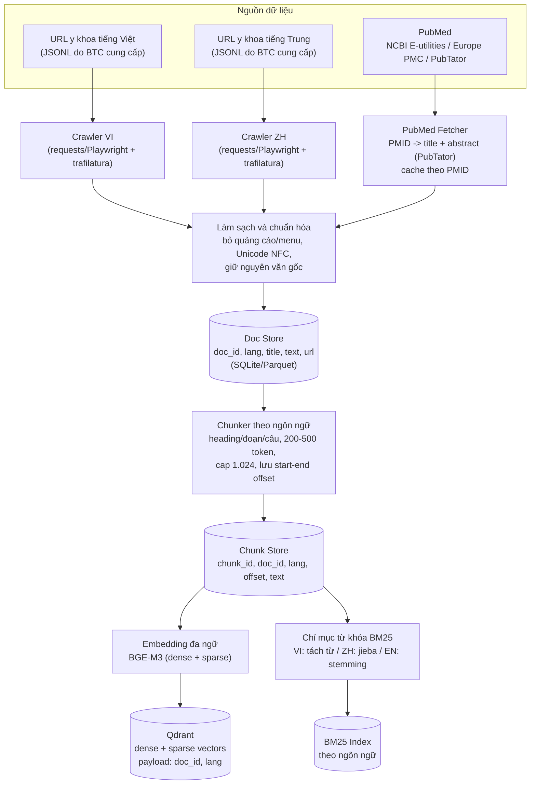
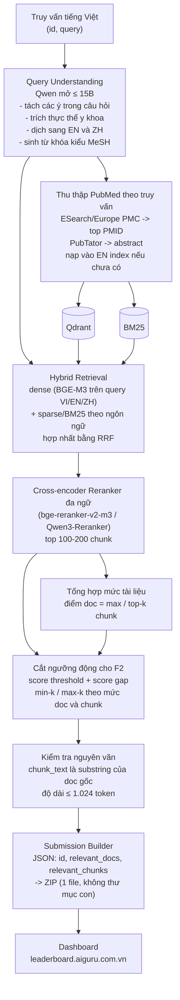
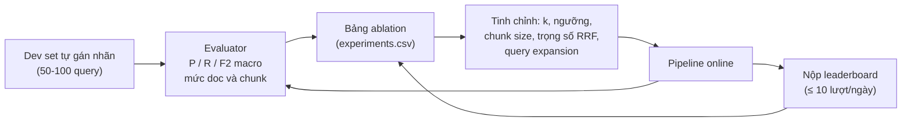

# Kế hoạch triển khai – R2AI2026: Truy hồi tài liệu y khoa đa ngôn ngữ (AI Guru Stage 3)

> Team: 2 thành viên (**A – Data & Indexing**, **B – Retrieval & Evaluation**)
> Ngày lập: 01/10/2026 (ngày phát hành public test)

---

## 1. Tóm tắt đề bài và hệ quả thiết kế

| Yêu cầu của đề | Hệ quả thiết kế |
|---|---|
| Query tiếng Việt → tìm tài liệu/đoạn liên quan ở **VI, EN, ZH** | Cần retriever **xuyên ngôn ngữ** (embedding đa ngữ + dịch truy vấn), không chỉ keyword |
| VI/ZH: BTC cho **danh sách URL** → tự crawl | Pipeline crawl + làm sạch HTML, `doc_id` = `id` trong file nguồn BTC |
| EN: **chỉ PubMed**, tự tìm theo từng câu hỏi (E-utilities / Europe PMC / PubTator) | Phải có bước **thu thập EN theo truy vấn** (query → PMID → abstract), `doc_id` = **PMID** |
| Chấm 2 mức: **document** và **chunk** (P, R, F2 macro) | Xuất cả `relevant_docs` và `relevant_chunks`; **F2 ưu tiên Recall** → không cắt top-k quá gắt |
| `chunk_text` **phải trích nguyên văn** từ tài liệu gốc, ≤ ~1.024 token | Lưu text gốc, chunk theo offset; có bước **kiểm tra substring** trước khi nộp. Không paraphrase/sinh mới |
| Chỉ dùng model **mở, phát hành trước 01/08/2026, ≤ 15B**; cấm LLM đóng | Dùng BGE-M3, reranker đa ngữ, Qwen mở (≤ 15B). **Không dùng GPT/Gemini/Claude** ở bất kỳ khâu nào của hệ thống (kể cả sinh dữ liệu giả lập) để an toàn về luật |
| Hiểu truy vấn y khoa nhiều ý trong 1 câu | Bước **query understanding**: tách ý, trích thực thể, dịch EN/ZH |
| Dữ liệu ngoài phải **trích dẫn nguồn rõ ràng** | Lưu `SOURCES.md` + metadata nguồn cho mọi dữ liệu ngoài |
| Private test chỉ có **5 lượt nộp**, tập query mới phát hành 01/11, hạn 04/11 | Pipeline phải **tự động hóa end-to-end**, chạy lại trong < 1 ngày với query mới (gồm cả crawl EN) |

### Mốc thời gian (23:59 UTC+7)

| Ngày | Sự kiện |
|---|---|
| 01/10 | Phát hành public test |
| **31/10** | Hạn nộp public test (mục tiêu của team: **nộp bản cuối 29/10** để còn dự phòng) |
| 01/11 | Bắt đầu private test |
| **04/11** | Hạn nộp hệ thống (tối đa **5 lượt** private) |
| 11/11 | Công bố kết quả; cần working notes paper |

---

## 2. Kiến trúc hệ thống

### 2.1 Pha Offline – Xây cơ sở tri thức



### 2.2 Pha Online – Xử lý từng truy vấn tiếng Việt



### 2.3 Pha Đánh giá và Tinh chỉnh (vòng lặp của team)



### 2.4 Lựa chọn công nghệ (ưu tiên thư viện/framework có sẵn)

| Thành phần | Gợi ý | Ghi chú |
|---|---|---|
| Embedding | **BGE-M3** (dense + sparse + multi-vector, đa ngữ) | Phù hợp VI/EN/ZH. Ứng viên thay thế: Qwen3-Embedding |
| Reranker | **bge-reranker-v2-m3** hoặc Qwen3-Reranker | Cross-lingual, chạy được trên 1 GPU |
| LLM query understanding | Qwen mở cỡ 7–14B (vLLM hoặc HF) | **Kiểm tra: phát hành trước 01/08/2026 và ≤ 15B** |
| Vector DB | **Qdrant** (hỗ trợ dense + sparse + payload filter) | Hoặc Milvus; chọn 1 và thống nhất |
| Orchestration | **LangChain** (retriever, EnsembleRetriever, compression/rerank) | Dùng component có sẵn thay vì tự viết |
| Crawl | trafilatura, Playwright (trang cần JS), Biopython/`requests` cho NCBI | Lấy **API key NCBI** để tăng rate limit |
| Tokenize | VI: `underthesea`/`pyvi` – ZH: `jieba` – EN: NLTK/spaCy | Chỉ dùng cho BM25; text xuất ra vẫn là gốc |
| Lưu trữ | Parquet/SQLite cho doc/chunk, DVC hoặc thư mục `data/` có versioning | Mỗi bước có file trung gian, chạy lại được |

> Mọi model phải được xác minh thủ công về **ngày phát hành < 01/08/2026** và **số tham số ≤ 15B** trước khi đưa vào hệ thống; ghi vào `SOURCES.md`.

---

## 3. Phân công vai trò

Hai người làm **song song nhưng có "hợp đồng dữ liệu"** (schema chung) ngay từ ngày đầu để không bị chờ nhau.

### Thành viên A – Data & Indexing (nền tảng dữ liệu)
- Crawl VI/ZH từ URL BTC, xử lý lỗi/URL chết/anti-bot, làm sạch nội dung.
- Xây module thu thập PubMed (ESearch/Europe PMC → PubTator), cache theo PMID.
- Chunking theo ngôn ngữ, lưu offset; dựng Doc Store, Chunk Store.
- Dựng Qdrant + BM25 index; script **index tăng dần** (thêm PMID mới mà không build lại).
- Hạ tầng chạy: GPU, môi trường (Docker/conda), script chạy batch.

### Thành viên B – Retrieval & Evaluation (chất lượng truy hồi)
- Query understanding (tách ý, dịch EN/ZH, từ khóa MeSH).
- Hybrid retrieval, RRF, reranker, tổng hợp doc, **ngưỡng cắt động tối ưu F2**.
- Xây dev set, evaluator (P/R/F2 mức doc và chunk), bảng ablation.
- Submission Builder + validator (schema, substring, ZIP đúng quy cách).
- (Tùy chọn) fine-tune embedding/reranker bằng dữ liệu mở hợp lệ.

### Chung
- Thống nhất schema, review chéo code, họp đồng bộ 15 phút mỗi ngày.
- Gán nhãn dev set chéo nhau (A gán một nửa, B gán một nửa, kiểm tra lại 20%).
- Viết working notes paper (A: phần dữ liệu; B: phần mô hình/đánh giá).

### Hợp đồng dữ liệu (chốt trong ngày 1–2)

```text
doc:    {doc_id, lang: vi|en|zh, title, text, url|null, source}
chunk:  {chunk_id, doc_id, lang, start, end, text}      # text == doc.text[start:end]
result: {id, relevant_docs[], relevant_chunks[{doc_id, chunk_text}]}
```

Lưu ý: `doc_id` VI/ZH lấy từ file nguồn BTC, EN là PMID. Nội bộ dùng khóa có tiền tố (`vi:123`, `zh:123`, `en:26739349`) để tránh trùng ID giữa các nguồn, chỉ **bỏ tiền tố khi xuất** `doc_id`.

### Cấu trúc repo (module nhỏ, mỗi file một việc)

```text
r2ai2026/
├─ configs/                 # yaml: model, k, ngưỡng, đường dẫn
├─ data/{raw,clean,chunks,index}/
├─ src/
│  ├─ crawl/{vi.py, zh.py, pubmed.py}
│  ├─ preprocess/{clean.py, chunk.py}
│  ├─ index/{embed.py, qdrant_store.py, bm25_store.py}
│  ├─ query/{understand.py, translate.py}
│  ├─ retrieve/{hybrid.py, rerank.py, cutoff.py, aggregate.py}
│  ├─ submit/{build.py, validate.py}
│  └─ eval/{metrics.py, devset.py, run_eval.py}
├─ scripts/{run_offline.sh, run_online.sh, make_submission.sh}
├─ SOURCES.md               # nguồn dữ liệu + model (ngày phát hành, kích thước)
└─ experiments.csv          # nhật ký thí nghiệm
```

---

## 4. Lộ trình chi tiết

### Giai đoạn 0 – Khởi động (01/10 – 02/10)
| A | B |
|---|---|
| Đọc file URL VI/ZH, thống kê số lượng, domain, kiểm tra truy cập | Đọc public test, phân loại kiểu truy vấn (1 ý/nhiều ý, thuật ngữ, lâm sàng) |
| Dựng repo, môi trường, đăng ký NCBI API key | Viết `metrics.py` (P/R/F2) theo đúng công thức đề |
| Chốt schema doc/chunk với B | Chốt schema result, viết validator định dạng ZIP/JSON |

**Deliverable:** repo chạy được, schema chốt, đã kiểm tra khả năng truy cập các nguồn.

### Giai đoạn 1 – Thu thập dữ liệu và baseline (02/10 – 09/10)
| A | B |
|---|---|
| Crawl VI + ZH quy mô đầy đủ (chạy nền, có retry, lưu checkpoint) | Baseline: BGE-M3 dense trên mẫu dữ liệu nhỏ, kiểm tra cross-lingual |
| Pipeline PubMed: query EN → PMID → abstract, cache | Query understanding v1 (dịch EN/ZH, tách ý) |
| Cleaner + chunker v1 | Dev set v1: 30–50 query gán nhãn tay |

**Deliverable:** Doc Store VI/ZH đầy đủ, fetcher PubMed chạy được, evaluator chạy được trên dev set.

### Giai đoạn 2 – Hệ thống end-to-end và nộp lần đầu (09/10 – 15/10)
| A | B |
|---|---|
| Index toàn bộ VI/ZH vào Qdrant + BM25 | Hybrid retrieval + RRF + reranker v1 |
| Thu thập EN cho **toàn bộ public test** (theo query dịch + mở rộng) | Cutoff đơn giản (top-k cố định), Submission Builder |
| Index tăng dần cho EN | **Nộp leaderboard lần đầu (mục tiêu ≤ 12/10)** để có mốc chuẩn |

**Deliverable:** submission baseline có điểm trên leaderboard; bảng ablation bắt đầu.

### Giai đoạn 3 – Tối ưu (15/10 – 25/10)
| A | B |
|---|---|
| Thử chunk size (200/300/500 token), overlap, chunk theo heading | Ngưỡng cắt động (score + gap), tối ưu **F2** riêng cho doc và chunk |
| Mở rộng EN (nhiều PMID/query, query MeSH, tìm theo từng ý con) | Query decomposition cho truy vấn nhiều ý; trọng số RRF theo ngôn ngữ |
| Làm sạch lỗi dữ liệu (trùng, nội dung rỗng, trang lỗi) | Thử reranker khác; (tùy chọn) fine-tune bằng dữ liệu mở hợp lệ |
| Tăng tốc pipeline (batch, cache embedding) | Phân tích lỗi: query nào miss, ngôn ngữ nào yếu |

Mỗi thí nghiệm: **thay đổi 1 biến → chạy dev set → ghi `experiments.csv` → chỉ nộp leaderboard cho cấu hình đáng giá** (≤ 10 lượt/ngày, tránh dò đáp án).

### Giai đoạn 4 – Đóng băng bản public (25/10 – 31/10)
- 25–27/10: chọn cấu hình tốt nhất, chạy lại toàn bộ từ đầu để chắc chắn tái lập được.
- 28/10: chạy **dry-run toàn bộ quy trình private** (giả lập: query mới → crawl EN → index → submit) và đo thời gian.
- **29/10: nộp bản public cuối** (dự phòng 2 ngày trước hạn 31/10).
- 30–31/10: sửa lỗi cuối, đóng băng code (tag `v1-public`), chuẩn bị checklist private.

### Giai đoạn 5 – Private test (01/11 – 04/11)
Ngân sách **5 lượt nộp** (cả đội):

| Lượt | Mục đích |
|---|---|
| 1 | Cấu hình tốt nhất từ public (chạy trên query mới) |
| 2 | Biến thể thiên về Recall (k lớn hơn / ngưỡng thấp hơn) |
| 3 | Biến thể thiên về Precision (k nhỏ hơn) – chỉ khi lượt 1–2 cho thấy xu hướng rõ |
| 4 | Sửa lỗi phát sinh/biến thể tốt nhất kết hợp |
| 5 | **Dự phòng** – bản cuối cùng, nộp **trước 04/11 18:00** |

| Thời điểm | Việc |
|---|---|
| 01/11 sáng | Tải query mới, chạy `run_online.sh`: dịch → **crawl EN theo query mới** → index tăng dần |
| 01–02/11 | Chạy pipeline, validate, nộp lượt 1 |
| 02–03/11 | Phân tích, nộp các lượt 2–4 có chủ đích |
| 04/11 | Chốt, nộp lượt cuối trước 18:00, **hạn 23:59** |

### Giai đoạn 6 – Báo cáo (05/11 – 11/11)
- Viết working notes paper: mô tả dữ liệu, pipeline, model (kèm ngày phát hành/kích thước), kết quả ablation, phân tích lỗi.
- Chuẩn bị mã nguồn và `SOURCES.md` để BTC kiểm tra khi cần.

---

## 5. Chiến lược tối ưu cho điểm F2

F2 = 5·P·R / (4·P + R) → **Recall quan trọng gấp ~4 lần Precision**, nên:

1. Lấy rộng ở bước retrieval (top 100–200), rerank rồi mới cắt.
2. **Mức doc:** giữ top-k tài liệu theo điểm rerank, với k thích nghi theo từng query (ngưỡng điểm + khoảng cách điểm giữa các doc liên tiếp).
3. **Mức chunk:** Precision tính trên số chunk trả về, nên ưu tiên chunk **ngắn, tập trung**; Recall tính theo "phần thông tin cần thiết được bao phủ" nên chunk phải bao đủ các ý của truy vấn nhiều ý (query decomposition → lấy chunk cho từng ý).
4. Tune k/ngưỡng **riêng cho doc và chunk**, riêng cho từng ngôn ngữ nếu dev set cho thấy khác biệt.
5. Đảm bảo đa dạng ngôn ngữ trong kết quả (không để EN lấn át VI/ZH khi nội dung VI/ZH vẫn liên quan).

---

## 6. Đánh giá nội bộ

- **Dev set:** 50–100 query (lấy từ public test), gán nhãn doc liên quan và đoạn thông tin cần thiết. Kiểm tra chéo 20% để đảm bảo thống nhất tiêu chí.
- **Metric:** tái hiện đúng công thức đề (Precision, Recall, F2 macro) ở mức doc và chunk; chunk được xem là relevant nếu overlap đủ với span đã gán nhãn (đặt ngưỡng overlap và ghi lại).
- **Leaderboard** dùng như tín hiệu độc lập bổ sung cho dev set, không dùng để "dò đáp án".
- **Bảng ablation tối thiểu:**

| Thí nghiệm | Doc F2 | Chunk F2 | Ghi chú |
|---|---|---|---|
| Dense only (BGE-M3) | | | baseline |
| + BM25 hybrid (RRF) | | | |
| + dịch query EN/ZH | | | |
| + reranker | | | |
| + query decomposition | | | |
| + cutoff động | | | |
| chunk 200 / 300 / 500 token | | | |

---

## 7. Rủi ro và phương án dự phòng

| Rủi ro | Mức độ | Biện pháp |
|---|---|---|
| URL VI/ZH chết, bị chặn crawl, cần JS | Cao | Retry + backoff, Playwright cho trang JS, ghi log URL lỗi; chấp nhận mất một phần nhỏ nhưng thống kê tỷ lệ |
| PubMed rate limit, thu thập EN chậm | Cao | API key NCBI, batch efetch, cache PMID, thu thập trước toàn bộ public test, **đã dry-run quy trình private** |
| Private test: ít ngày, phải crawl EN cho query mới | Cao | Pipeline tự động, index tăng dần, chạy thử ngày 28/10, giữ sẵn pool EN rộng từ public |
| `chunk_text` không khớp nguyên văn gốc → mất điểm | Cao | Chunk bằng offset, validator substring bắt buộc trước khi zip; không rewrite/sinh text |
| Vi phạm quy định model (đóng, > 15B, phát hành sau 01/08/2026) | Cao | Kiểm tra từng model, ghi `SOURCES.md`; không dùng LLM đóng ở bất kỳ khâu nào |
| Quá khớp dev set nhỏ | Trung bình | Dev set đa dạng kiểu câu hỏi, dùng leaderboard làm kiểm chứng, tránh tune quá chi tiết |
| Thiếu GPU/chậm khi embedding + rerank | Trung bình | Batch + fp16, cache embedding, giới hạn số ứng viên rerank, dùng reranker nhỏ nếu cần |
| Nộp sai định dạng (ZIP có thư mục con, thiếu query) | Trung bình | `validate.py` kiểm tra: đủ mọi `id`, trường rỗng thì để `[]`, ZIP chỉ chứa 1 file `.json` ở gốc |
| Một thành viên bị bận/ốm | Trung bình | Code review chéo, README chạy từng bước, mỗi người nắm được pipeline của người kia |

---

## 8. Checklist trước mỗi lần nộp

- [ ] Đủ mọi `id` trong tập test; `id` là integer
- [ ] Mỗi mục có đủ `relevant_docs` và `relevant_chunks` (rỗng thì `[]`)
- [ ] `doc_id` EN là PMID, VI/ZH là `id` trong file nguồn BTC (đã bỏ tiền tố nội bộ)
- [ ] Mọi `chunk_text` là substring của tài liệu gốc, ≤ ~1.024 token
- [ ] Chỉ 1 file `.json` trong ZIP, không nằm trong thư mục con
- [ ] Ghi vào `experiments.csv` (cấu hình, điểm dev, điểm leaderboard)
- [ ] Còn đủ lượt nộp trong ngày (≤ 10) / giai đoạn private (≤ 5)

---

## 9. Sản phẩm bàn giao cuối cùng

1. Mã nguồn có thể tái lập (script chạy offline + online + build submission).
2. `SOURCES.md`: nguồn dữ liệu ngoài, model dùng (ngày phát hành, số tham số).
3. File submission `.zip` (public và private).
4. Working notes paper mô tả đầy đủ phương pháp (điều kiện để kết quả được công nhận chính thức).