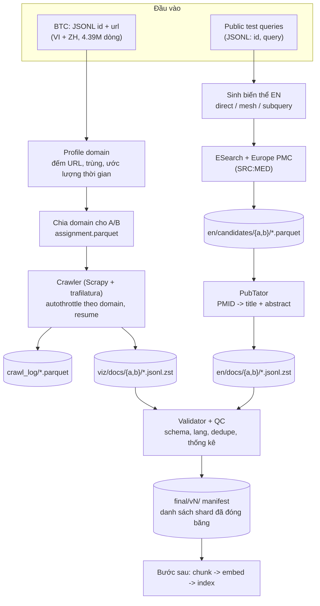

# Kế hoạch thu thập Corpus – R2AI2026 (Truy hồi tài liệu y khoa đa ngôn ngữ)

> Phạm vi: xây corpus **VI + ZH** (4.39M URL do BTC cung cấp) và **EN** (PubMed, thu thập theo truy vấn)
> Team: 2 người – **A** và **B**
> Tài liệu này là **quy ước bắt buộc** cho cả hai người: cấu trúc thư mục, định dạng, metadata, cách chia việc, cách gộp dữ liệu.

---

## 1. Nguyên tắc chung

1. **JSONL nén zstd** (`.jsonl.zst`) cho văn bản tài liệu. JSON thuần chỉ dùng cho file nộp bài (đề bắt buộc).
2. **Parquet** cho các bảng cần lọc/group-by (log crawl, bảng ứng viên PMID).
3. **`text` là nguồn sự thật duy nhất.** Chuẩn hóa đúng một lần khi ghi corpus; mọi offset chunk tính trên chuỗi này. Nhờ vậy `chunk_text` luôn là *substring nguyên văn* của tài liệu (điều kiện bắt buộc của đề).
4. **Không chunk ở bước thu thập.** Corpus lưu tài liệu nguyên vẹn, chunk là bước sau (để thử nhiều kích thước).
5. **Không xóa im lặng.** Trang rỗng/lỗi/trùng vẫn có dòng log với `status` rõ ràng; chỉ loại khỏi index ở bước sau. Cần số liệu mất mát cho working notes.
6. **Không lưu HTML thô cho toàn bộ.** Chỉ lưu HTML của mẫu pilot và các trang lỗi để debug.
7. **Mỗi người chỉ ghi vào thư mục của mình** (`.../a/` hoặc `.../b/`). Không bao giờ sửa file của người kia.
8. **Ghi atomically:** ghi ra `*.tmp` rồi `rename` khi shard hoàn chỉnh; shard dở dang không được xuất hiện với tên chính thức.
9. **Mọi nguồn dữ liệu và model đều phải ghi vào `SOURCES.md`** (đề yêu cầu trích dẫn rõ nguồn dữ liệu ngoài).
10. Dữ liệu **không** commit vào git (chỉ code, schema, manifest nhỏ). Dữ liệu lưu ở ổ chung/DVC/rsync.

---

## 2. Sơ đồ luồng thu thập



---

## 3. Cấu trúc thư mục corpus (BẮT BUỘC)

```text
corpus/
├─ README.md                      # tóm tắt quy ước (bản rút gọn của file này)
├─ SOURCES.md                     # nguồn dữ liệu + model: tên, URL, ngày lấy, giấy phép/ghi chú
├─ schema/
│  ├─ doc.schema.json             # schema tài liệu (mục 4)
│  ├─ crawl_log.schema.json       # schema log crawl (mục 5)
│  ├─ candidate.schema.json       # schema bảng ứng viên EN (mục 6)
│  └─ manifest.schema.json        # schema manifest shard (mục 7)
│
├─ viz/                           # VI + ZH
│  ├─ input/
│  │  ├─ btc_sources.jsonl.zst    # bản gốc BTC, KHÔNG sửa
│  │  ├─ domain_profile.parquet   # đếm URL theo domain, ước lượng thời gian
│  │  └─ assignment.parquet       # domain -> owner (a|b); mỗi URL đúng 1 owner
│  ├─ crawl_log/
│  │  ├─ a/log-a-00001.parquet
│  │  └─ b/log-b-00001.parquet
│  ├─ docs/
│  │  ├─ a/viz-a-00001.jsonl.zst
│  │  └─ b/viz-b-00001.jsonl.zst
│  ├─ manifest/
│  │  ├─ a/viz-a-00001.manifest.json
│  │  └─ b/viz-b-00001.manifest.json
│  └─ debug_html/                 # chỉ mẫu pilot + trang lỗi (giới hạn dung lượng)
│
├─ en/                            # PubMed
│  ├─ queries/
│  │  ├─ public_test.jsonl        # bản gốc BTC, KHÔNG sửa
│  │  └─ variants/{a,b}/variants-{a|b}-00001.jsonl   # biến thể EN do LLM sinh
│  ├─ candidates/
│  │  ├─ a/cand-a-00001.parquet
│  │  └─ b/cand-b-00001.parquet
│  ├─ docs/
│  │  ├─ a/en-a-00001.jsonl.zst
│  │  └─ b/en-b-00001.jsonl.zst
│  ├─ manifest/{a,b}/en-{a|b}-00001.manifest.json
│  ├─ pmid_registry.parquet       # PMID đã tải (cache toàn cục): pmid, shard, fetched_at
│  └─ annotations/                # (tùy chọn) thực thể PubTator, tách khỏi docs cho nhẹ
│
├─ qc/
│  ├─ reports/qc-YYYYMMDD.md      # báo cáo chất lượng theo ngày
│  └─ stats/*.parquet             # thống kê theo domain/ngôn ngữ/status
│
└─ final/
   ├─ v1/                         # đóng băng VI/ZH v1 (14/10) – chỉ chứa manifest, không copy dữ liệu
   │  └─ shards.json              # danh sách shard + sha256
   └─ v2/ ...                     # EN đóng băng (28/10), các phiên bản sau
```

### Quy ước đặt tên

| Loại | Mẫu tên | Ví dụ |
|---|---|---|
| Shard docs VI/ZH | `viz-{owner}-{seq:05d}.jsonl.zst` | `viz-a-00007.jsonl.zst` |
| Shard docs EN | `en-{owner}-{seq:05d}.jsonl.zst` | `en-b-00003.jsonl.zst` |
| Log crawl | `log-{owner}-{seq:05d}.parquet` | `log-a-00001.parquet` |
| Ứng viên EN | `cand-{owner}-{seq:05d}.parquet` | `cand-b-00002.parquet` |
| Manifest | `{tên shard}.manifest.json` | `viz-a-00007.manifest.json` |

- `owner` ∈ {`a`, `b`}; `seq` tăng dần **độc lập** theo từng owner → không bao giờ trùng tên.
- Kích thước shard: **20.000–50.000 tài liệu** (khoảng 50–150MB sau nén; cần đo lại khi pilot).
- Thời gian: ISO 8601 kèm múi giờ (`2026-10-05T10:00:00+07:00`).

---

## 4. Schema metadata của tài liệu (dùng chung VI / ZH / EN)

Mỗi dòng của `docs/*.jsonl.zst` là một JSON object:

```json
{
  "schema_version": "1.0",
  "uid": "vi:123456",
  "doc_id": "123456",
  "lang": "vi",
  "source": "btc_url",
  "url": "https://example.com/bai-viet",
  "domain": "example.com",
  "title": "Tiêu đề bài viết",
  "text": "Nội dung đã chuẩn hóa ...",
  "norm_version": "n1",
  "passages": [
    {"type": "title", "start": 0, "end": 18},
    {"type": "heading", "start": 19, "end": 40},
    {"type": "body", "start": 41, "end": 980}
  ],
  "text_len": 5321,
  "content_hash": "sha1:...",
  "dup_of": null,
  "fetch": {
    "status": "ok",
    "http_status": 200,
    "fetched_at": "2026-10-05T10:00:00+07:00",
    "extractor": "trafilatura@x.y.z",
    "lang_detected": "vi",
    "lang_conf": 0.99
  },
  "pubmed": null,
  "owner": "a",
  "code_commit": "abc1234"
}
```

Với tài liệu **EN**, trường `pubmed` được điền, `url` có thể là `https://pubmed.ncbi.nlm.nih.gov/<PMID>/`:

```json
"pubmed": {
  "pmid": "26739349",
  "year": 2016,
  "journal": "…",
  "doi": "…",
  "pub_types": [],
  "mesh": []
}
```

### Bảng trường

| Trường | Bắt buộc | Kiểu | Quy tắc |
|---|---|---|---|
| `schema_version` | ✔ | string | `"1.0"`; đổi khi schema đổi |
| `uid` | ✔ | string | `"{lang}:{id}"`; **khóa nội bộ duy nhất**. Với VI/ZH `id` là `id` trong file BTC; với EN là PMID |
| `doc_id` | ✔ | string | **Giá trị xuất ra submission**: VI/ZH = `id` BTC, EN = PMID. Luôn lưu dạng string, chuyển về đúng kiểu khi xuất |
| `lang` | ✔ | enum | `vi` \| `zh` \| `en` (giá trị cuối cùng sau lang-detect) |
| `source` | ✔ | enum | `btc_url` \| `pubmed` |
| `url`, `domain` | ✔ (VI/ZH) | string | Domain chuẩn hóa chữ thường, bỏ `www.` |
| `title` | ✔ | string | Có thể rỗng nếu không trích được |
| `text` | ✔ | string | Văn bản chuẩn hóa (xem quy tắc dưới). **Không được rỗng** với `status=ok` |
| `norm_version` | ✔ | string | Phiên bản hàm chuẩn hóa, ví dụ `n1` |
| `passages` | ✔ | array | Các đoạn `{type, start, end}` với `text[start:end]` hợp lệ; `type` ∈ `title\|abstract\|heading\|body` |
| `text_len` | ✔ | int | `len(text)` (ký tự Unicode) |
| `content_hash` | ✔ | string | `sha1(text)` – dùng để phát hiện trùng |
| `dup_of` | ✔ | string\|null | `uid` của bản gốc nếu trùng nội dung, ngược lại `null` |
| `fetch.status` | ✔ | enum | Xem bảng trạng thái ở mục 5 |
| `fetch.*` | ✔ | object | `http_status`, `fetched_at`, `extractor`, `lang_detected`, `lang_conf` |
| `pubmed` | ✔ (EN) | object\|null | Chỉ điền với EN |
| `owner` | ✔ | enum | `a` \| `b` |
| `code_commit` | ✔ | string | Commit git của code đã tạo ra bản ghi |

### Quy tắc chuẩn hóa `text` (`norm_version = n1`)

Hàm chuẩn hóa **dùng chung một file code** (`src/preprocess/normalize.py`), không ai tự viết riêng:

- Unicode **NFC** (quan trọng với tiếng Việt: dấu dựng sẵn).
- Bỏ ký tự điều khiển và ký tự zero-width; chuyển `\r\n` → `\n`.
- Gộp khoảng trắng/xuống dòng thừa (tối đa 2 `\n` liên tiếp, 1 khoảng trắng liên tiếp); `strip()` hai đầu.
- **Không** đổi chữ hoa/thường, **không** đổi dấu câu, **không** đổi toàn-bán góc (ký tự full-width tiếng Trung), **không** tách/ghép từ.
- Đổi quy tắc chuẩn hóa = tăng `norm_version` và tạo lại shard, không sửa tại chỗ.

### Quy tắc lấy nội dung

| Ngôn ngữ | Nội dung `text` | Ghi chú |
|---|---|---|
| EN | Title + Abstract lấy từ **PubTator** (`passages` đánh dấu `title`/`abstract`) | PubTator nhiều khả năng cùng nguồn với nhãn của BTC → chunk dễ trùng span nhãn |
| VI/ZH | Nội dung chính trích bằng **trafilatura**: giữ tiêu đề, heading, đoạn văn; bỏ menu, quảng cáo, footer | Chunk-level chấm theo overlap với “phần thông tin cần thiết”, nên **không làm sạch quá tay**. Pilot so sánh 2 extractor trên mẫu trước khi chạy hàng loạt |

---

## 5. Log crawl (theo từng URL)

Mỗi URL của BTC có **đúng một dòng** log cuối cùng (có thể nhiều dòng nếu ghi lịch sử retry, khi đó dùng `attempt`):

| Trường | Kiểu | Mô tả |
|---|---|---|
| `uid` | string | `{lang_hint}:{id}`; nếu chưa biết ngôn ngữ dùng `src:{id}` và sửa khi có kết quả lang-detect |
| `id` | int | `id` gốc trong file BTC |
| `url`, `domain` | string | |
| `owner` | enum | `a` \| `b` |
| `status` | enum | Xem bên dưới |
| `http_status` | int\|null | |
| `attempt` | int | Số lần thử |
| `fetched_at` | timestamp | |
| `bytes` | int\|null | Kích thước phản hồi |
| `final_url` | string\|null | Sau redirect |
| `error` | string\|null | Thông điệp lỗi ngắn |
| `shard` | string\|null | Tên shard docs chứa bản ghi (nếu ghi thành công) |

**Enum `status` (dùng thống nhất cho log và `fetch.status`):**

| Giá trị | Ý nghĩa |
|---|---|
| `ok` | Lấy và trích nội dung thành công |
| `empty` | Tải được nhưng không trích được nội dung chính |
| `too_short` | Nội dung dưới ngưỡng tối thiểu (ngưỡng ghi trong config) – vẫn giữ để thống kê |
| `http_error` | Phản hồi HTTP lỗi (4xx/5xx) sau hết retry |
| `timeout` | Hết thời gian chờ sau hết retry |
| `blocked` | Bị chặn/captcha – **ghi nhận và bỏ qua, không tìm cách né chặn** |
| `lang_mismatch` | Ngôn ngữ phát hiện khác kỳ vọng (vẫn lưu, `lang` theo kết quả phát hiện) |
| `duplicate` | Trùng nội dung với tài liệu khác (`dup_of` được điền) |

Cần tuân thủ `robots.txt` và giới hạn tốc độ theo domain.

---

## 6. Bảng ứng viên EN (provenance)

`en/candidates/*.parquet` – mỗi dòng là một cặp (truy vấn, biến thể, PMID tìm được):

| Trường | Kiểu | Mô tả |
|---|---|---|
| `qid` | int | `id` truy vấn trong public/private test |
| `variant_id` | string | Ví dụ `q12-v3` |
| `variant_type` | enum | `direct` (dịch trực tiếp) \| `mesh` (từ khóa/thực thể kiểu MeSH) \| `subquery` (tách theo từng ý) |
| `query_text_en` | string | Câu truy vấn thực sự đã gửi đi |
| `source` | enum | `esearch` \| `europepmc` |
| `rank` | int | Thứ hạng kết quả trả về |
| `pmid` | string | |
| `fetched_at` | timestamp | |
| `owner` | enum | `a` \| `b` |

Bảng này phục vụ: (1) biết PMID nào đến từ truy vấn nào, (2) đo **fetch-recall** khi có nhãn dev, (3) tái lập, (4) báo cáo.
`pmid_registry.parquet` chống tải lặp (cache toàn cục): `pmid`, `shard`, `fetched_at`, `owner`.

---

## 7. Manifest của shard

`manifest/{owner}/{tên shard}.manifest.json`, ghi **sau khi** shard ghi xong:

```json
{
  "shard": "viz-a-00007.jsonl.zst",
  "owner": "a",
  "schema_version": "1.0",
  "norm_version": "n1",
  "n_docs": 30000,
  "status_counts": {"ok": 27410, "empty": 1210, "too_short": 900, "lang_mismatch": 480},
  "lang_counts": {"vi": 21000, "zh": 8500},
  "sha256": "…",
  "created_at": "2026-10-06T18:20:00+07:00",
  "input": {"type": "domain_list|id_range|pmid_batch", "value": "…"},
  "extractor": "trafilatura@x.y.z",
  "code_commit": "abc1234"
}
```

Gộp dữ liệu (`final/vN/shards.json`) chỉ là **danh sách các manifest/shard + sha256** đã qua validator, không copy dữ liệu.

---

## 8. Validator (bắt buộc chạy trước khi báo “xong shard”)

Script: `src/qc/validate_corpus.py` – kiểm tra tự động mỗi shard:

- [ ] Mọi dòng parse được JSON và khớp `doc.schema.json`
- [ ] `uid` duy nhất trong shard **và** không trùng với shard khác (đối chiếu qua registry)
- [ ] `lang` ∈ {vi, zh, en}; `doc_id` là string không rỗng
- [ ] Với `status=ok`: `text` không rỗng, `text_len == len(text)`, `passages` nằm trong `[0, len(text)]`
- [ ] `content_hash` đúng với `text`
- [ ] Tên file đúng quy ước, `owner` trong dòng khớp thư mục chứa shard
- [ ] Manifest tồn tại, `n_docs` khớp, `sha256` khớp
- [ ] Với EN: `doc_id == pubmed.pmid`

Shard không qua validator **không** được đưa vào `final/`.

---

## 9. Thu thập VI + ZH (4.39M URL)

Nút thắt là **giới hạn tốc độ theo từng domain**, không phải tổng băng thông:
`thời gian ≈ số URL của domain / số req/giây cho phép của domain đó`.
Ví dụ domain có 1M URL ở 1 req/s mất khoảng 11,6 ngày → cần profile domain trước mọi thứ.

**Các bước:**

1. **Profile domain (ngày 1–2):** đếm URL theo domain, phát hiện URL trùng, ước lượng thời gian crawl từng domain → `domain_profile.parquet`.
2. **Chia domain A/B** (`assignment.parquet`): cân bằng **tổng thời gian ước lượng**, không cân bằng số URL; mỗi domain thuộc đúng một người (không hai người cùng gọi một domain). Mỗi người chạy trên máy/IP riêng.
3. **Pilot 20k URL phân tầng theo domain:** đo tỷ lệ `ok`, tốc độ, dung lượng, chất lượng 2 extractor; chốt `norm_version`, ngưỡng `too_short`.
4. **Crawl toàn bộ:** Scrapy (autothrottle, giới hạn đồng thời theo domain, `JOBDIR` để resume) + trafilatura; Playwright chỉ cho domain cần JS; xen kẽ domain để tổng throughput cao mà mỗi domain vẫn lịch sự.
5. **Vòng retry:** URL lỗi chạy lại với backoff; domain liên tục bị chặn thì ghi `blocked` và bỏ qua.
6. **Hậu xử lý:** lang-detect (xác minh `lang`), dedupe theo `content_hash`, gắn `status`.
7. Mỗi shard xong → validator → báo cho người kia/bước chunk-embed lấy ngay (không chờ crawl xong toàn bộ).

Ước lượng tham khảo (cần đo lại bằng pilot): crawl 10 ngày liên tục cần ≥ ~5 req/s trung bình; 20 req/s ≈ 61 giờ. Dung lượng sau nén ≈ vài GB đến vài chục GB.

---

## 10. Thu thập EN (PubMed)

PubMed rất lớn, nên **đi theo hướng truy vấn**, không crawl toàn bộ.

```text
query VI
 └─ LLM mở (≤ 15B, phát hành trước 01/08/2026) sinh biến thể EN:
      (a) direct  – dịch trực tiếp
      (b) mesh    – thực thể/từ khóa kiểu MeSH
      (c) subquery – tách theo từng ý trong câu hỏi
 └─ mỗi biến thể: ESearch (relevance, top 100–200) + Europe PMC (SRC:MED, top 100)
 └─ gộp, dedupe PMID  → ghi en/candidates/ (kèm provenance)
 └─ lọc PMID chưa có trong pmid_registry
 └─ PubTator theo batch → ghi en/docs/ (chỉ giữ bài có abstract; bài không có abstract ghi log, không bỏ im lặng)
```

| Tầng | Nội dung | Thời điểm |
|---|---|---|
| **T1** | Ứng viên theo toàn bộ query public test (vài biến thể/query) | 05/10 – 10/10 |
| **T2** | Pool rộng cho private test (quét theo nhóm chuyên khoa/MeSH tầng cao) để query mới 01/11 đã có sẵn phần lớn kết quả | 10/10 – 25/10 |
| **T3** | Bổ sung theo query private lúc 01/11 (delta nhỏ, chạy trong vài giờ) | 01/11 |

Quy mô: `số query × số biến thể × ~100–200 PMID` rồi trừ trùng. **Sau T1 phải đo số PMID duy nhất thực tế** rồi mới quyết định độ rộng T2.
Nút thắt không phải API mà là chi phí embedding/index phía sau, nên ưu tiên chất lượng ứng viên hơn số lượng.

**Vận hành:** mỗi người một NCBI API key; cache theo PMID; log mọi request lỗi; batch khi gọi PubTator/EFetch.
Giới hạn tốc độ của từng API (NCBI, Europe PMC, PubTator) cần **kiểm tra lại theo tài liệu hiện hành** trước khi chạy lớn.

Nếu cân nhắc dùng bản tải hàng loạt PubMed (baseline FTP của NCBI) cho T2 thay vì API, nên **hỏi BTC xem có được chấp nhận không**, vì đề chỉ liệt kê API ở dạng gợi ý.

---

## 11. Phân công A / B

Giai đoạn này chia theo **nguồn dữ liệu** (VI/ZH nặng hơn EN rất nhiều), sau đó cân bằng lại.

| Thời gian | **A – VI/ZH lead** | **B – EN lead + QC** |
|---|---|---|
| 01–02/10 | Profile domain; chốt hạ tầng crawl (máy, đĩa, IP) | Smoke test 3 API; lấy NCBI key; module sinh biến thể EN |
| 01–02/10 (chung) | Chốt schema/quy ước (file này), tạo cây thư mục, viết `normalize.py` + validator khung | |
| 03–05/10 | Pilot 20k URL; chọn extractor | PubMed pipeline v1 trên ~50 query; đo số PMID/query |
| 05–10/10 | Crawl đợt chính (phần domain của A) | EN tầng **T1** đầy đủ, `pmid_registry` |
| ~07/10 | Cùng cân bằng lại `assignment.parquet`: B nhận thêm domain khi T1 xong | Crawl phần domain của B (máy/IP riêng) và chạy T2 song song |
| 10–14/10 | Retry, lang-detect, dedupe VI/ZH | QC tổng hợp, báo cáo chất lượng, merge manifest |
| **14/10** | **Đóng băng VI/ZH `final/v1`** | EN v1 |
| 14–28/10 | Vá lỗi domain, sửa extractor nếu cần (tạo shard mới, tăng `norm_version` nếu đổi chuẩn hóa) | Mở rộng EN theo phân tích lỗi retrieval (T2 bổ sung); **đóng băng EN 28/10** |
| 01/11 | Hỗ trợ chạy pipeline | **T3**: sinh biến thể → ESearch/EuropePMC → PubTator cho query private |

**Chung:** họp đồng bộ 15 phút mỗi ngày; PR review chéo cho mọi thay đổi `schema/`, `normalize.py`, `assignment.parquet`.

### Quy trình đổi quy ước

Mọi thay đổi schema/chuẩn hóa/enum phải: (1) sửa `schema/` + file này, (2) tăng `schema_version`/`norm_version`, (3) người kia xác nhận trước khi chạy hàng loạt. **Không** sửa tại chỗ các shard đã ghi.

---

## 12. Kiểm soát chất lượng và chỉ số theo dõi

Báo cáo QC hàng ngày (`qc/reports/qc-YYYYMMDD.md`) gồm:

- Tỷ lệ theo `status` (ok / empty / too_short / http_error / blocked …) theo **domain** và theo **ngôn ngữ**.
- Phân bố độ dài `text`; tỷ lệ trùng (`dup_of`); tỷ lệ `lang_mismatch`.
- Tiến độ crawl: số URL đã xử lý / tổng, ước lượng ngày hoàn thành.
- EN: số PMID duy nhất, số bài có abstract, tỷ lệ PMID trùng giữa các biến thể.
- **Fetch-recall EN** (khi có dev set gán nhãn): % PMID liên quan nằm trong pool. Nếu thấp, lỗi nằm ở thu thập chứ không phải retriever.

**Dự phòng cho embed 4.39M tài liệu** (rất tốn GPU): đo tốc độ embedding ngay từ pilot; nếu quá chậm, dùng BM25 cho toàn bộ và dense chỉ cho tập ứng viên, hoặc chỉ embed phần đầu mỗi tài liệu cho vòng lọc thô.

---

## 13. Rủi ro

| Rủi ro | Biện pháp |
|---|---|
| Một domain quá lớn, rate limit thấp → crawl kéo dài | Profile domain từ đầu; ưu tiên domain lớn chạy sớm; chấp nhận độ phủ không 100% nhưng thống kê rõ |
| URL chết/chặn/cần JS | Retry + backoff, Playwright cho domain cần JS, ghi `blocked`, không né chặn |
| Trích nội dung khác cách BTC → lệch span nhãn chunk | Giữ nội dung đủ, pilot so sánh extractor; EN dùng PubTator cùng nguồn |
| Hai người ghi đè/xung đột dữ liệu | Thư mục theo owner, tên shard có owner, ghi atomic, manifest + sha256 |
| `id` trùng giữa VI và ZH | Khóa nội bộ `uid = lang:id`; chỉ bỏ tiền tố khi xuất `doc_id` |
| PubMed rate limit / API lỗi | API key mỗi người, cache `pmid_registry`, retry có backoff, chạy T1/T2 trước hạn |
| Private test quá sát hạn (01/11 → 04/11) | T2 tạo pool rộng sẵn; T3 chỉ là delta; chạy thử quy trình ngày 28/10 |
| Thiếu đĩa/RAM | Đo ở pilot; nén zstd; chỉ lưu HTML mẫu/lỗi |
| Vi phạm quy định model | Chỉ dùng model mở, phát hành trước 01/08/2026, ≤ 15B; ghi `SOURCES.md`; không dùng LLM đóng ở bất kỳ khâu nào |

---

## 14. Giả định cần xác nhận

| Giả định | Nếu sai |
|---|---|
| `id` duy nhất trong toàn bộ 4.39M dòng; xác định được dòng nào là VI hay ZH (từ file hoặc bằng lang-detect) | Phải đổi quy tắc `uid` và cách xuất `doc_id` |
| Mỗi người có máy/IP riêng và đủ đĩa | Không chia đôi crawl được, thời gian gần gấp đôi |
| Số query public test cỡ vài trăm đến vài nghìn | Quy mô EN T1/T2 đổi theo công thức ở mục 10 |
| Rate limit các API đúng như kỳ vọng | Điều chỉnh số biến thể/query và thời gian T1/T2 |

---

## 15. Checklist bàn giao

**Mỗi shard:**
- [ ] Tên đúng quy ước, ghi atomic, có manifest + sha256
- [ ] Validator xanh
- [ ] Đã cập nhật log crawl / `pmid_registry`

**Mỗi lần đóng băng (`final/vN`):**
- [ ] Mọi shard liệt kê có sha256 khớp
- [ ] Báo cáo QC mới nhất đính kèm
- [ ] `SOURCES.md` đã cập nhật
- [ ] Hai người cùng xác nhận